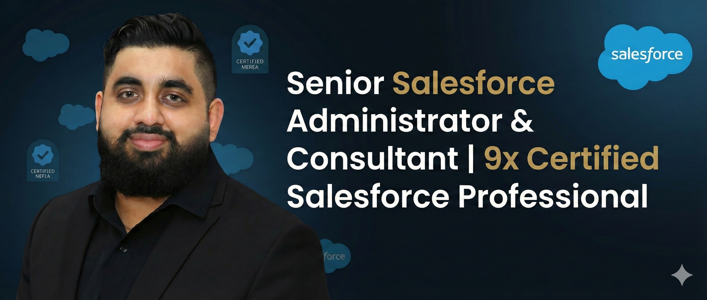

# ☁️ Mohamed Imran
**Senior Salesforce Administrator & Consultant | 9x Certified | CPQ • RevOps • AI/Agentforce • Flow Automation | Transforming Revenue Operations with Data-Driven Solutions | Scaling Businesses Efficiently**
*6+ Years Experience • 1,500+ Users Managed • Top 1% Trailhead All Star Ranger*

---

## 👨‍💻 Professional Summary
I am a **Senior Salesforce Administrator & Consultant** with six years of experience managing enterprise environments (1,500+ users) for organizations like **OneTrust** and **KinderCare**. I specialize in **AI-powered automation**, **CPQ revenue operations**, and **Event-Driven Architecture**.

My focus is on **Digital Transformation**—moving beyond basic configuration to architect "Business Operating Systems" that solve root-cause problems. I have led end-to-end **Classic to Lightning migrations**, converted legacy technical debt into optimized Flow automation, and maintained **99% system uptime** through strict security compliance.

---

## 🏆 Certifications (9x)
| Core & Admin | Consultants & Developers | Specialized & AI |
| :--- | :--- | :--- |
| ☑️ Certified Administrator | ☑️ Sales Cloud Consultant | ☑️ AI Associate |
| ☑️ Advanced Administrator | ☑️ Service Cloud Consultant | ☑️ Marketing Cloud Admin |
| ☑️ Platform App Builder | ☑️ Platform Developer I | ☑️ Platform Foundations |

**Additional Credentials:**
* **Trailhead All-Star Ranger:** 705+ Badges | 30 Superbadges
* **MBA:** Strategic Management & Leadership (University of Gloucestershire)

---

## 🛠️ Core Competencies & Tech Stack
* **AI & Automation:** Agentforce, Einstein Trust Layer, Prompt Builder, Next Best Action.
* **CPQ & RevOps:** Product Bundles, Price Rules, Quote-to-Cash, Subscription Management.
* **Advanced Flow:** Record-Triggered, Screen Flows, Schedule-Triggered, Flow Orchestrator.
* **Architecture:** Event-Driven Architecture (Platform Events), Async Apex, External Services (HTTP).
* **Analytics:** CRM Analytics (Tableau CRM), Custom Report Types, Executive Dashboards.

---

## 🚀 Featured Portfolio Projects

| Project | Role | Tech Stack |
| :--- | :--- | :--- |
| **[1. Enterprise Flow Series (5-Part Suite)](./project-1-flow-series)** • *Smart Discount Guardrails (CPQ)* • *Smart Case Escalation* • *Customer Health Signal Hub* • *Fair Workload Engine* • *Real-Time Credit Risk Engine* | Senior Administrator | Advanced Flow, CPQ, HTTP Callouts |
| **[2. Agentforce AI Trust Engine](./project-2-ai-trust)** | AI Architect | Einstein Trust Layer, Prompt Engineering |
| **[3. Service Cloud Excellence](./project-3-service-cloud)** | Consultant | Omni-Channel, Escalation Rules |
| **[4. Partner Onboarding (Orchestrator)](./project-4-orchestrator)** | Architect | Flow Orchestrator, Experience Cloud |
| **[5. ApexFlow ERP (Supply Chain)](./project-5-erp)** | Lead Architect | Apex, Inventory Architecture, Batch Flow |
| **[6. Event-Driven Revenue Architecture](./project-6-revenue)** | Solution Architect | Platform Events, Async Apex, Finance |

---

## 📬 Contact
* **LinkedIn:** [Connect with me on LinkedIn](https://www.linkedin.com/in/mohamedmunas/)
* **Trailhead:** [View my Trailblazer Profile](https://www.salesforce.com/trailblazer/mohamedmunas)
* **Email:** [mohamedimran.munas@gmail.com](mailto:mohamedimran.munas@gmail.com)
