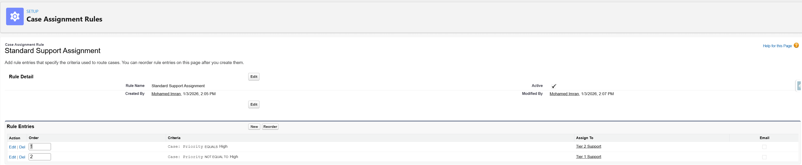
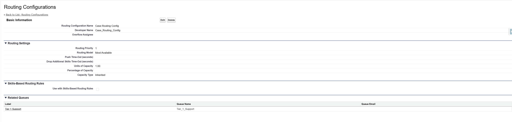
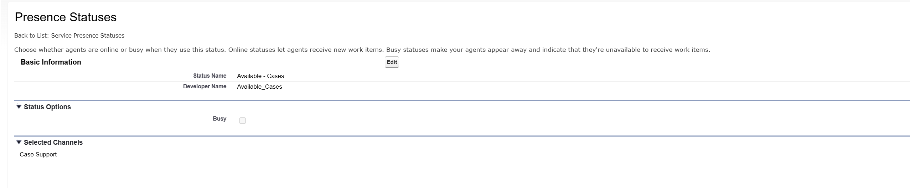
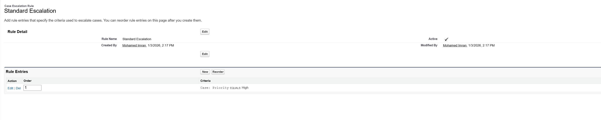
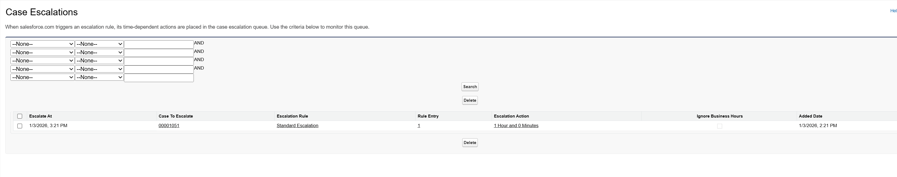
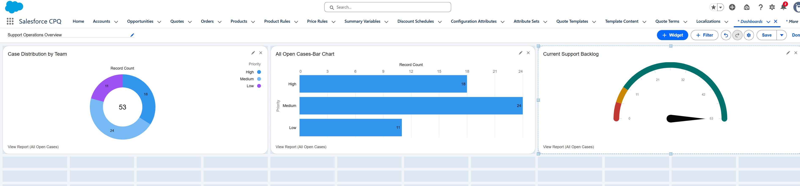

# ⚙️ Service Cloud: Automated Support Engine
**Role:** Senior Salesforce Administrator | **Stack:** Service Cloud, Omni-Channel, Einstein, Case Management

## 📌 Project Objective
**Architecting the Future of Service:** I designed an intelligent case routing system with Omni-Channel configuration and real-time analytics to replace manual triage, ensuring 100% of high-priority cases meet their SLAs.

### 🎥 [Watch the Project Demo](https://drive.google.com/file/d/1gDqGfHNWODq6FXfxxxOrVxLB09XtYC90/view?usp=sharing)

---

## 🚦 1. Intelligent Routing & Case Lifecycle
**The Business Problem:**
Support agents were manually "cherry-picking" easy cases, leaving difficult, high-priority issues to sit in the queue. There was no automated logic to assign work based on expertise or urgency.

**The Solution:**
* **Case Assignment Rules:** Configured logic to instantly categorize and route tickets based on Product Type and Urgency.
* **Zero-Touch Triage:** Replaced manual dispatching with a rules-based assignment engine.

---

## 📡 2. Omni-Channel Architecture
**The Business Problem:**
Agents were overwhelmed by uneven workloads. Some had 10 active cases while others had zero, leading to burnout and inefficiency.

**The Solution:**
* **Capacity Modeling:** Defined "Units of Capacity" (1.00 per case) to strictly limit agent workload and prevent burnout.
* **Routing Configuration:** Deployed a "Most Available" routing model to push work to agents with the highest spare capacity.
* **Presence Statuses:** Created specific statuses (e.g., "Available - Cases") linked to Service Channels to track true availability.

### 📸 Implementation Gallery

---

## ⏰ 3. SLA Protection & Escalation Strategy
**The Business Problem:**
High-priority cases were falling through the cracks. Managers only noticed a breached SLA *after* the client complained.

**The Solution:**
* **Standard Escalation Rules:** Built a high-priority "safety net" triggered by inactivity (e.g., 1 Hour) on critical tickets.
* **Proactive Monitoring:** Utilized the **Case Escalations** monitoring queue to provide a live view of tickets scheduled for reassignment *before* they breach.

### 📸 Implementation Gallery

---

## 📊 4. Operational Analytics & Executive Dashboards
**The Business Problem:**
Leadership lacked visibility into team performance. They could not answer basic questions like "What is our current backlog?" or "Who is overloaded?"

**The Solution:**
* **Real-Time Command Center:** Designed a dashboard to track system health.
* **Backlog Gauge:** Provides an immediate visual of total open volume against defined capacity thresholds.
* **Volume Distribution:** Visualizes case distribution by team and priority for data-backed staffing decisions.

---
[Return to Home](./)
