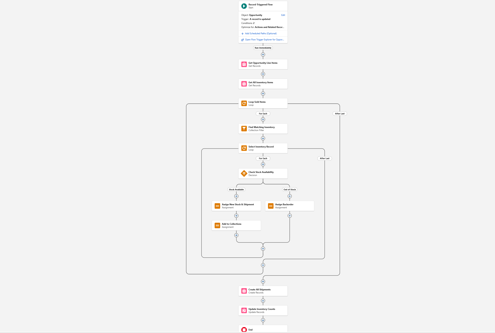

# 📦 ApexFlow ERP: End-to-End Supply Chain Automation
**Role:** Lead Developer & Architect | **Stack:** Apex, Advanced Flow, Supply Chain Architecture

## 📌 Project Objective
**From CRM to ERP:** In this flagship project, I moved beyond standard CRM configuration to architect a "Business Operating System." I built a native ERP engine inside Salesforce to solve the "Quote-to-Cash" latency gap, achieving a "Zero-Touch" Supply Chain where closed deals drive logistics in real-time.

### 🎥 [Watch the Project Demo](https://drive.google.com/file/d/1UuQH5x9_qPhjVdDo6uUaw1JVe2Gtjp4k/view?usp=sharing)

---

## 🚫 1. The Business Problem
In high-volume sales organizations, there is often a dangerous "data disconnect" between Sales (CRM) and Operations (ERP).
* **Phantom Selling:** Sales reps were closing deals for products that were physically out of stock.
* **Manual Procurement:** Operations relied on spreadsheets to decide when to reorder, leading to revenue leakage and slow fulfillment.

**The Solution:**
I architected a single automated ecosystem linking Sales, Inventory, and Procurement.

---

## 🏗️ 2. "Single Source of Truth" Architecture
I eliminated spreadsheets by designing a custom relational schema.
* **Data Model:** Accounts (Vendors), Warehouses, and Inventory Ledgers are now mathematically linked to Opportunities.
* **Impact:** Sales and Operations always see the exact same real-time data.

### 📸 Data Model & Schema

---

## 🔄 3. Automated Demand & Procurement Logic
I replaced manual data entry with event-driven automation:
* **Demand:** Sales immediately deplete inventory counts upon Opportunity Close.
* **Supply:** Low stock levels automatically trigger Purchase Order generation, preventing stockouts before they happen.

### 📸 Automation in Action

---

## ⚙️ 4. Advanced Technical Governance (Bulkification)
**The Challenge:** Processing "Goods Receipt" (large inbound shipments with hundreds of line items) often hits Salesforce Governor Limits.
**The Fix:**
* **Loop-Collection-Commit Pattern:** I built an advanced Flow that processes bulk line items in a single transaction.
* **Scalability:** The system handles massive inventory updates without timing out or hitting SOQL limits.

### 📸 Flow Logic & Governance

.png)
.png)

### 📸 Analytics
.png)

---
[Return to Home](./)
