# 📺 Project: Autonomous Aid (Agentforce & Orchestrator)
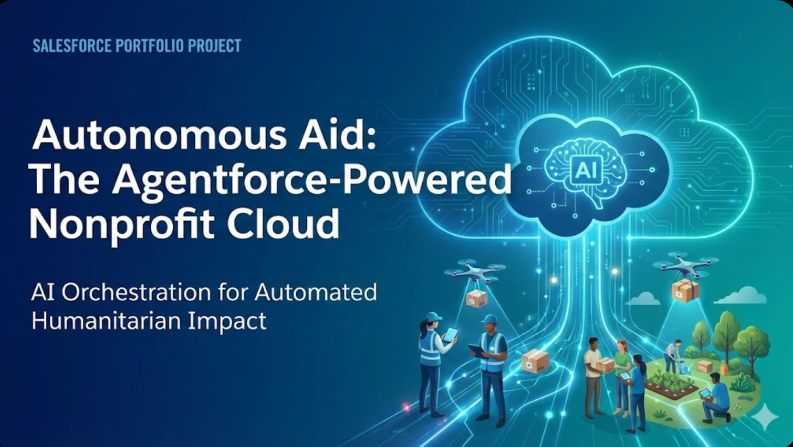

## The Business Problem
Humanitarian organizations face a "Black Box" problem during crises. Grant approvals sit in email inboxes while field teams wait for funds (latency), and donors rarely receive specific updates on how their money was used until months later (transparency), leading to poor donor retention.

## The Solution
* **Event-Driven Trigger:** I engineered a Platform Event (`Disaster_Signal__e`) that simulates integration with weather systems to auto-initialize relief grants instantly.
* **Orchestration Engine:** A **Flow Orchestrator** manages the lifecycle, enforcing a "Stage Lock" where Finance cannot approve funds until Field Assessments are verified.
* **AI Stewardship:** I deployed **Agentforce Prompt Builder** to read specific grant outcomes (e.g., "1,000 Tarps") and auto-generate personalized, hallucination-free impact emails to donors.

### 🎥 [Watch the Video Demo] *(https://drive.google.com/file/d/1uwW6kgHTgFpCL2A0CS1JsNN-vr5zn77M/view?usp=sharing)**

---

### 📸 Implementation Gallery

#### 1. Architecture & Data Model
I designed a lean, custom schema to support high-speed data entry without the overhead of the full Nonprofit Cloud managed package.

- **Core Object:** `Rapid_Response_Grant__c` acts as the central ledger.
- **Key Fields:** Configured `Supplies Deployed` and `Impact Outcome` as Long Text Areas to store the qualitative data required for the AI engine.
- **Schema Visualization:** shows the clean relationship design, ensuring the grant record connects Field data, Finance data, and Donor data in a single view.
- To simulate an integration with external weather warning systems, I utilized Salesforce Platform Events.

- **Event Definition:** Created `Disaster_Signal__e` to carry payload data like `Severity_Level__c` and `Region__c`.
- **The Listener:** Built a Platform-Event Triggered Flow (`Disaster Signal Listener`) that "listens" for these signals and instantly creates the Grant record, launching the orchestration 0.5 seconds after the event occurs.
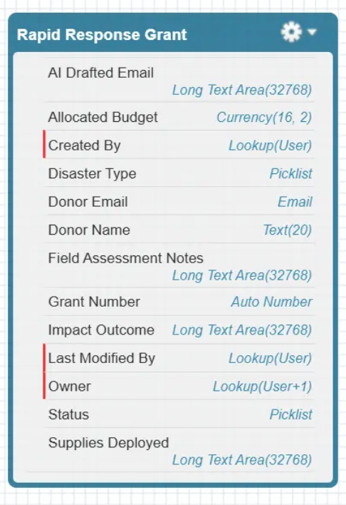
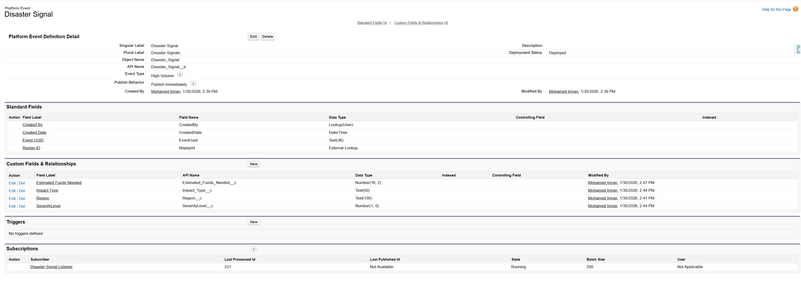
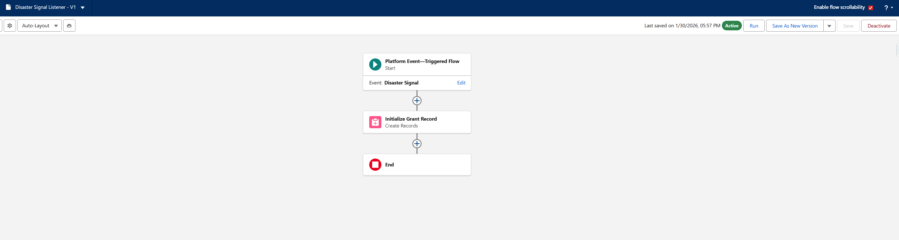

#### 2. The Engine (Flow Orchestrator)
The heart of the system is the **Grant Lifecycle Orchestrator**. Unlike standard flows, this manages long-running processes across different teams.

- **Assessment Stage:** Assigns work immediately to Field Officers.
- **Finance Review Stage:** Engineered a "Stage Lock" dependent on the previous step, preventing premature fund disbursement.
- **Impact Verification Stage:** A dormant stage that activates only after funds are spent, calling the user back to log results.
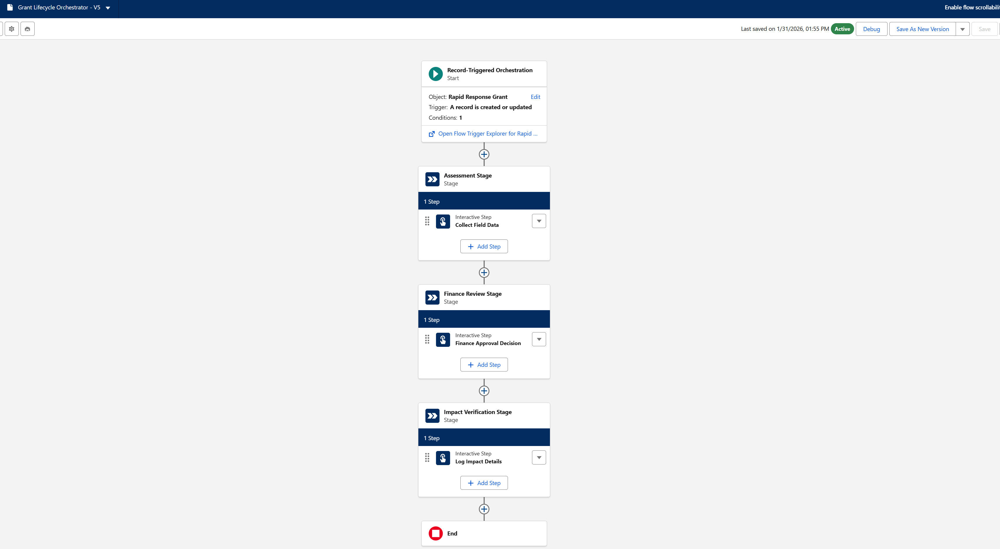

#### 3. Sub-Flow Automation
The heart of the system is the **Grant Lifecycle Orchestrator**. Unlike standard flows, this manages long-running processes across different teams.

- **Assessment Stage:** Assigns work immediately to Field Officers.
- **Finance Review Stage:** Engineered a "Stage Lock" dependent on the previous step, preventing premature fund disbursement.
- **Impact Verification Stage:** A dormant stage that activates only after funds are spent, calling the user back to log results.
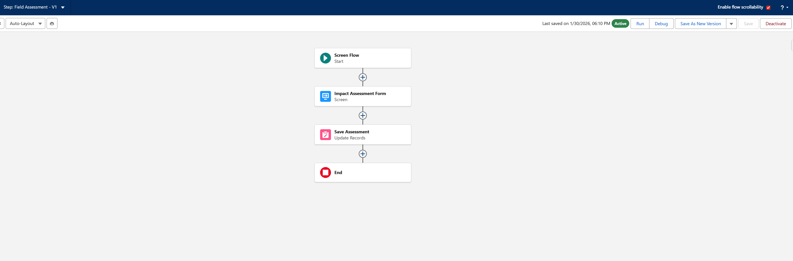
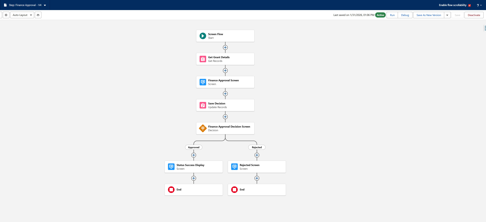
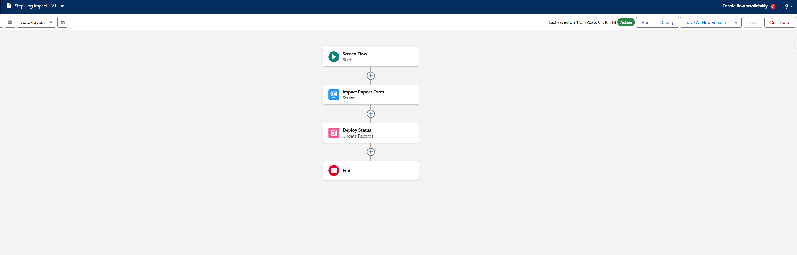

#### 4. AI Layer (Agentforce)
*To solve the donor reporting problem, I deployed **Einstein Trust Layer** via Prompt Builder.

- **Prompt Engineering:** Designed the `Draft Donor Impact Email` template. The prompt instructions ground the AI in the specific record data (`Supplies_Deployed__c`), ensuring the output is factual, not hallucinated.
- **User Experience:** Configured the "Sparkle Button" directly on the record page.
- **The Result:** The AI generates a fully personalized, emotionally resonant email, referencing the exact "1,000 Tarps" and "Restored Power" outcomes logged by the field team.
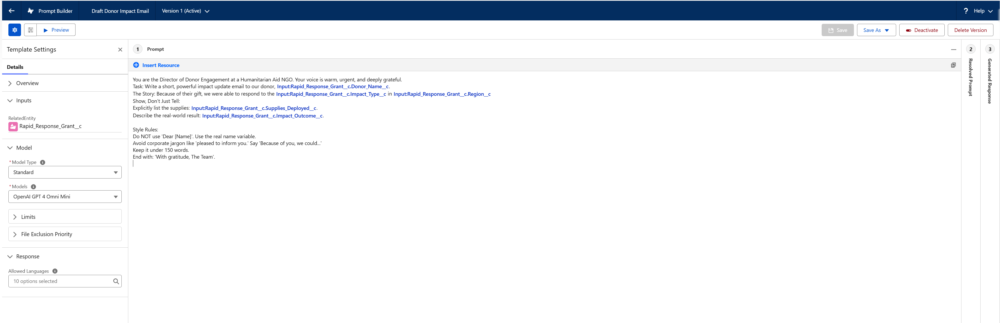
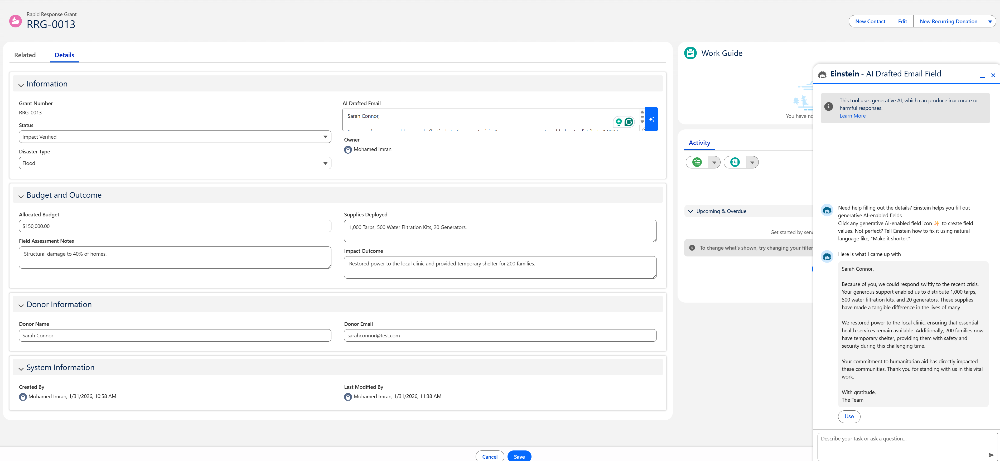
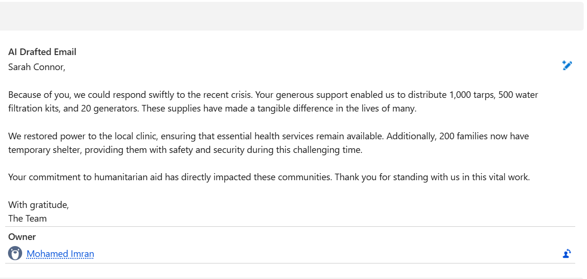

---
[Return to Home](../)
